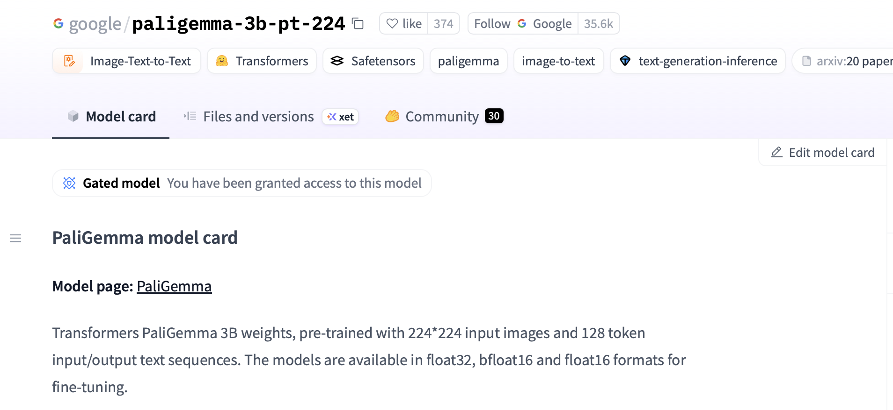

# Frequently Asked Questions

Common errors:
- [OSError: You are trying to access a gated repo](#failing-pytest-tests-due-to-Hugging-Face-errors)
- OSError: Too many open files when training a policy locally with S3-hosted data
    - Run `$ ulimit -n 65535  # or at least 4096`
- `raise ReadError("empty file") from None` during training
    - This likely means the number of workers is too high. Reduce `--data.num_workers`. 
- [Unable to locate AWS credentials](#setting-up-aws-sso)

## Failing pytest tests due to Hugging Face errors
This error usually shows up as something like 
```
FAILED tests/essential/data/test_robotics_dataloader.py::test_batch_size[2] - OSError: You are trying to access a gated repo.
```

This is likely due to not having access to the [PaliGemma](google/paligemma-3b-pt-224) model that is being used in the test cases. The following are useful to check:

1. **HF access**: You first need to visit [https://huggingface.co/google/paligemma-3b-pt-224](https://huggingface.co/google/paligemma-3b-pt-224) and click "Accept" to gain access to the PaliGemma model. If this is successful, it should say *"You have been granted access to this model"*. See the image below:

<picture>
  
</picture>

2. **HF token**: You then need to create a HF token at [https://huggingface.co/settings/tokens](https://huggingface.co/settings/tokens). The permissions need to be **"Write"**. Then, make sure that this token is present locally in `~/.cache/huggingface/token`. Alternatively, you can also add `export HF_TOKEN=hf-token-here` to your `~/.bashrc` file.

3. **HF token on GitHub**: Note that when running tests out of your own fork, you may need to add your own HF_TOKEN in `Settings`. See screenshot below.

<picture>
  
</picture>

## Setting up AWS credentials

Configure your AWS credentials following your organization's SSO setup guide, or use `aws configure` for direct access key authentication. Make sure the `AWS_PROFILE` environment variable is set (or add it to your `.bashrc` / `.zshrc`) so you don't have to specify it every time.
