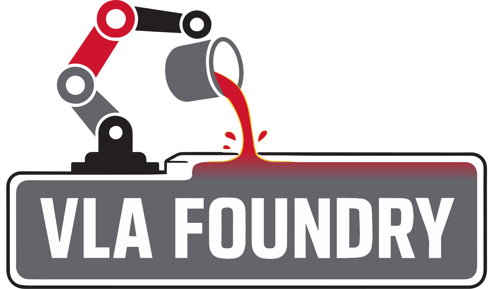

<picture>
  <source media="(prefers-color-scheme: dark)" srcset="assets/logo_dark.svg" width="800">
  <source media="(prefers-color-scheme: light)" srcset="assets/logo.svg" width="800">
  
</picture>


<p align="center">
  <a href="https://arxiv.org/abs/2604.19728"></a>
  <a href="https://tri-ml.github.io/vla_foundry/"></a>
  <a href="https://huggingface.co/collections/TRI-ML/vla-foundry"></a>
  <a href="https://github.com/TRI-ML/vla_foundry/blob/main/LICENSE"></a>
  <a href="https://github.com/TRI-ML/vla_foundry/stargazers"></a>
  <a href="https://github.com/TRI-ML/vla_foundry/graphs/contributors"></a>
</p>

# VLA Foundry
VLA Foundry is a framework for training Vision-Language-Action models. We support the following:
- **Multiple modalities**: Train a model with text, image-captions, or robotics data. With VLA Foundry, you can train an LLM, then use the checkpoint to train a VLM, then use the checkpoint to train a VLA -- all at one place without any external dependencies. 
- **Multi-node training**: VLA Foundry supports [FSDP2](https://docs.pytorch.org/tutorials/intermediate/FSDP_tutorial.html) and streams datasets with [WebDatasets](https://github.com/webdataset/webdataset). Multi-GPU training works well locally with `torchrun` and on large clusters with AWS SageMaker.
- **Dataset mixing**: Dataset sources and ratios can be specified during dataloading time, allowing for easy dataset mixing and batch balancing.
- **Modular and maintainable design**: VLA Foundry is built for flexibility and ease of development. Most modules are implemented with pure PyTorch, without any external libraries. This makes it easier to modify the training pipeline and add new features.
- **Hugging Face support**: Modules can either be loaded using the native PyTorch implementation, or loaded using pre-trained weights from Hugging Face. This allows users to develop on top of state-of-the-art model releases for LLMs, VLMs, CLIP models, etc.

## Contents
- [Installation](#installation)
- [Contributing Guidelines](#contributing-guidelines)
- [Quickstart](#quickstart)
    - [Running on SageMaker](#running-on-sagemaker)
- [Troubleshooting FAQ](#troubleshooting-faq)
- [Deployment Examples](#deployment-examples)
- [Repo Structure and Implementation](#repo-structure-and-implementation)
  <ol type="1">
    <li><a href="#1-paramargument-structure">Param/Argument Structure</a></li>
    <li><a href="#2-data">Data</a></li>
    <li><a href="#3-dataloading-pipeline">Dataloading Pipeline</a></li>
    <li><a href="#4-model-saving--loading">Model Saving / Loading</a></li>
    <li><a href="#5-training">Training</a></li>
    <li><a href="#6-logging">Logging</a></li>
    <li><a href="#7-linting">Linting</a></li>
    <li><a href="#8-tests">Tests</a></li>
  </ol>
- [Citation](#citation)
- [Acknowledgements](#acknowledgements)

## Installation
We recommend using [uv](https://docs.astral.sh/uv/getting-started/installation/) for environment management. Please follow the uv documentation for installation. Once uv is installed, create a Python 3.12 virtual environment using uv and install the project dependencies with the command below:
```bash
uv sync
uv pip install -e .
```
The recommended workflow is to run scripts directly with `uv` via `uv run <script> <args>`.
Alternatively, to activate the virtual env you can then run `source .venv/bin/activate` then proceed as usual (though should still use `uv` for package and dependency management).

## Contributing Guidelines
Please see [CONTRIBUTING.md](CONTRIBUTING.md)

## Troubleshooting FAQ
For some common questions or errors, please check the [FAQ.md](FAQ.md) file for troubleshooting tips.

## Quickstart
The main entrypoint is `vla_foundry/main.py`. Please see [the guide](FAQ.md#setting-up-aws-credentials) to complete the AWS credentials configuration beforehand.

An example command is something like this:
```bash
.venv/bin/torchrun --nproc_per_node=8 --nnodes=1 vla_foundry/main.py \
--model "include vla_foundry/config_presets/models/vlm_3b.yaml" \
--model.vit "include vla_foundry/config_presets/models/vit_paligemma.yaml" \
--data.type image_caption \
--data.processor google/paligemma-3b-pt-224 \
--data.dataset_manifest ["s3://your-bucket/your-path/datasets/datacompdr_1b/manifest.jsonl"] \
--data.dataset_modality ["image_caption"] \
--data.dataset_weighting [1.0] \
--data.img_num_tokens 256 \
--total_train_samples 14_000_000 \
--num_checkpoints 5 \
--hparams.per_gpu_batch_size 2 \
--hparams.global_batch_size 64 \
--remote_sync s3://your-bucket/your-path/vla_foundry_scratch/vlm_paligemma_3b
```

See [tutorials/](tutorials) for end-to-end walkthroughs of training, preprocessing, and evaluation — start with [training_llm_vlm_vla.ipynb](tutorials/training_llm_vlm_vla.ipynb) for the basics and [lerobot.ipynb](tutorials/lerobot.ipynb) for robotics. [examples/](examples) has shorter, copy-paste-ready CLI scripts for each major workflow.

For an LBM policy evaluation walkthrough, follow the [LBM deployment guide](docs/guides/deployment.md).

### Running on SageMaker
Create a `secrets.env` file in the project's root directory:
```bash
WANDB_API_KEY=<your wandb key>
HF_TOKEN=<your hf token>
```

To launch something on SageMaker, the launch file is [sagemaker/launch_training.py](sagemaker/launch_training.py).
Pass arguments in a similar way as you would for a local run.
Note that you have to run this with `uv run --group sagemaker`. This creates a temporary venv used in running the script
where sagemaker is installed. The reason to do this is so that the local and sagemaker environments match
(when sagemaker is installed it changes other dependencies).

```bash
uv run --group sagemaker sagemaker/launch_training.py \
--sagemaker.user your.user.name \
--sagemaker.instance_count 1 \
--sagemaker.instance_type p4de \
--insert_experiment_arguments_here (no_need_for_sagemaker_prefix)
```

## Deployment
For lightweight evaluation utilities and gRPC policy server templates, see
`vla_foundry/inference/scripts/README.md` (or the [deployment guide](docs/guides/deployment.md)).

## Repo Structure and Implementation
The sections below highlight several key design choices and functionalities of the repo.

### 1. Param/Argument Structure
We use [draccus](https://github.com/dlwh/draccus) for argument parsing. Params are defined in the [vla_foundry/params](vla_foundry/params) folder. We use nested parameters. There is a high level `cfg` dataclass object in [vla_foundry/main.py](vla_foundry/main.py). This dataclass has attributes which are dataclasses themselves, namely `cfg.model`, `cfg.hparams`, `cfg.data`, and `cfg.distributed`, which themselves contain attributes like `cfg.model.hidden_dim`.

#### 1.1 Argument Parsing Usage
Below we show an example of how we supply arguments (see the [tutorials](tutorials) for end-to-end usage):
```bash
--model.type transformer \
--model "include vla_foundry/config_presets/models/transformer_11m.yaml" \
--distributed.fsdp True \
--data.type text \
--data.dataset_manifest ["s3://your-bucket/your-path/your_llm_pretraining_dataset/manifest.jsonl"] \
--data.dataset_modality ["text"] \
--data.dataset_weighting [1.0] \
--data.seq_len 2048 \
--total_train_samples 14_000_000 \
--num_checkpoints 5 \
--hparams.per_gpu_batch_size 8 \
--hparams.global_batch_size 512
```

A few usage notes:
- We pass arguments by prepending the subclass, separated by a period, for example `--model.hidden_dim`. We can also nest multiple layers deep, for example `--model.vit.n_layers`
- For `model` and `data`, we are **required** to set `--model.type` and `--data.type`, which will indicate which specific subclass of `ModelParams` or `DataParams` we will instantiate. For example, `--model.type=transformer_hf` will instantiate `cfg.model` as a `TransformerHFParams` object.
- As seen in the example above, we can use the `--model "include ..."` argument to recycle presets that we want to use repeatedly. This `include` can be used for any parameter class that is loaded with draccus.
- When including a preset in a yaml file, the path must be relative to the file and the statement is `arg: !include <path>`.
- When including a preset file, command line arguments still take precedence (i.e., if an overlapping argument is supplied in the command line, it will overwrite the value from the preset yaml).
- Arguments are immutable by design, and we recommend developing around this. If really necessary, `object.__setattr__` can be used to modify an immutable argument.

#### 1.2 Separation of Concerns
We have five high-level param class types:
- `DataParams`: Each modality has its own `DataParams` class, which inherits from the base `DataParams` object. 
- `ModelParams`: Each model type has its own `ModelParams` class, which inherits from the base `ModelParams` object. The logic for model selection is done in the `create_model` function in [models/\_\_init\_\_.py](/vla_foundry/models/__init__.py). This param class is saved to `(output_path)/model_config.yaml` during training and can be used to load the yaml during inference time.
- `HyperParams`: This handles things like learning rate and optimizers.
- `EMAParams`: This handles EMA parameters.
- `DistributedParams`: This handles things like FSDP parameters. This is automatically initialized with `init_distributed_device()`, which is called in the `post_init()` function of `DistributedParams`. The `init_distributed_device()` function automatically sets things like `rank` and `world_size`, so you do not need to set these parameters. It is explicitly indicated in [distributed_params.py](/vla_foundry/params/distributed_params.py) which ones do not need to be set.
- `TrainExperimentParams`: This is the main params class that [main.py](/vla_foundry/main.py) reads. It contains the other 4 param classes as attributes, and it handles global variables like save paths. This param class is saved to `(output_path)/config.yaml` during training and can be used during inference time.

We generally want to have some separation of concerns here. For instance, we do not want to pass a `DataParams` class to a model object, since we want to have the ability to load a model during inference time, even without any dataset. In instances where we need to access some `DataParams` object in our model, we can make use of the `init_shared_attributes()` function, which we detail in the "Shared Arguments" section below.
- Note: It is not always clear which parameter should belong in which class. For a more detailed discussion on this, see the "Shared Arguments" section below.


#### 1.3 Shared Arguments
- Sometimes attributes may need to be accessed in multiple param classes. For example, we may want to have both `cfg.hparams.seed` and `cfg.data.seed`.
- To prevent the user needing to supply the same argument twice, and to ensure coherence, we pick an "owner" class for the attribute, then for the non-owner class, we list the attribute under the `init_shared_attributes()` function which is automatically called after initialization and populates all shared attributes.
    - As a rule of thumb, whichever component is the _source of truth_ for a parameter should own it. For example, the model may require access to the `action_dim` parameter, but this is inherently tied to the dataset, so we prefer this to be in `DataParams` then shared to `ModelParams` instead of the other way around.
       - This might require some conceptual understanding of what the parameter fundamentally is for, and for some parameters, there might be some room for debate, but in practice, as long as `init_shared_attributes()` is implemented properly, the selection of "owner" will not have any meaningful effect outside of code style and readability.
    - `init_shared_attributes(self, cfg)` is called with full access to the entire `TrainExperimentParams` config object. This means that each subclass (and so on recursively) can set shared params from any of the `TrainExperimentParams` parameters.

- We can also have arguments with the same name but are not shared. For instance, `cfg.data.seq_len` and `cfg.model.seq_len` are defined separately. The one in `cfg.data` controls the padding/truncation during dataloading, while the one in `cfg.model` is used for the rotary embedding.
    - (Note: Now updated to `cfg.model.max_seq_len` instead of just `cfg.model.seq_len`, but point still holds.)

#### 1.4 Dynamic Selection
Consider the following definition of the `VLMParams`
```python
@register_model_params("vlm")
@dataclass(frozen=True)
class VLMParams(ModelParams):
    vit: ViTParams | ViTHFParams = field(default_factory=ViTParams)
    transformer: TransformerParams | TransformerHFParams = field(default_factory=TransformerParams)
```

Here, the ViT can either be `ViTParams` or `ViTHFParams`. We can dynamically pick between the two by directly supplying the necessary arguments. For example, indicating `--model.vit.hf_pretrained=vit_base_patch16_siglip_224` will automatically instantiate `cfg.model.vit` as a `ViTHFParams` object, while `--model.vit.hidden_dim=1152` will automatically instantiate `cfg.model.vit` as a `ViTParams` object. No need to indicate `--model.vit.type` in this case.

#### 1.5 Defaults and Config Presets
The parameter classes for each module can be found in [vla_foundry/params](vla_foundry/params). They list exhaustively all the parameters that can be set. Some of these are given a default value directly in the class definition. 

In addition, the [vla_foundry/config_presets](vla_foundry/config_presets) folder contains a set of yaml file which contain commonly used config settings. These are not strictly necessary but can help ensure consistency and reduce bugs. These can be used with the `include` keyword. For instance, you can use `--model "include vla_foundry/config_presets/models/transformer_410m.yaml"` instead of manually typing out all the model configs. These yamls can be nested with the `<<` operator. See `vla_foundry/config_presets/models/diffusion_policy.yaml`.

The order of precedence is as follows (listed in decreasing priority):
1. Command line
2. Preset yaml configs (Parent yaml has priority over nested yamls)
3. Default in params class

In other words, if a variable is defined both in a preset yaml and in the command line, the parser will use the value from the command line.

#### 1.6. Known Limitations
- When including a preset in a yaml file with `!include <path>`, we cannot re-define part of its members. More specifically, we might want to load a preset config, then change only a few attributes while preserving the rest. In the example below, the following yaml will not work; it would reset the other transformer parameters to the default ones and not preserve the ones from `../models/diffusion_policy.yaml`.

```yaml
model:
  <<: !include ../models/diffusion_policy.yaml    # This yaml defines the transformer
  # What if we want to change only one attribute of the transformer?
  # NOTE: The following block does NOT work. It overrides fields from the included diffusion_policy.yaml.
  transformer:
    is_causal: True
```

Instead we need to redefine all transformer parameters, as shown below:

```yaml
model:
  <<: !include ../models/diffusion_policy.yaml

  transformer:
    <<: !include ../models/transformer_100m.yaml
    is_causal: True
```

For such cases, we recommend just using a command line argument like `--model.transformer.is_causal True`, which would work as expected.

### 2. Data
Data are stored in shards. Each shard is a tar file. Within each tar file, each sample is distinguished by its unique prefix.
The structure of the directory is as follows:

```
dataset_name/
├── manifest.jsonl
├── shard_00000000.tar
│   ├── unique_name_or_hash_1_image1.jpg
│   ├── unique_name_or_hash_1_image2.jpg
│   ├── unique_name_or_hash_1_image3.jpg
│   ├── unique_name_or_hash_1_meta.json
│   ├── unique_name_or_hash_1_caption.json
│   ├── unique_name_or_hash_1_actions.npz
│   ├── unique_name_or_hash_1_otherstuff.json
│   ├── unique_name_or_hash_2_...json
│   ├── unique_name_or_hash_3_...json
├── shard_00000001.tar
│   ├── unique_name_or_hash_100_...json
├── shard_00000002.tar
├── shard_00000003.tar
└── ...
```

In the directory above, the `unique_name_or_hash_1_...` files make up the first sample, the `unique_name_or_hash_2_...` files make up the second sample, and so on. Each tar file can have hundreds or thousands of samples.

The `manifest.jsonl` provides an overview of the tar files as follows:
```
{"shard": "00000000", "num_sequences": 4518}
{"shard": "00000001", "num_sequences": 4617}
{"shard": "00000002", "num_sequences": 4625}
{"shard": "00000003", "num_sequences": 4701}
```

The dataset can be either local or on S3. An example is `s3://your-bucket/your-path/datasets/datacompdr_1b/`.

During dataloading, the code will read `manifest.jsonl`, shuffle the rows, then select the appropriate number of tar files for the given number of training steps.

#### 2.1 Multiple Datasets
Use the `--data.dataset_manifest` argument to indicate which dataset to use for training. To use more than one dataset, you can supply multiple comma-separated manifests. For example, `--data.dataset_manifest ["s3://your-bucket/your-path/datasets/datacompdr_1b/manifest.jsonl","s3://some-other-dataset/manifest.jsonl"]`.

Webdatasets also supports different dataset ratios. This is done through the `--data.dataset_weighting` argument. For example, `--data.dataset_weighting [0.4,0.6]`.

#### 2.2 Robotics Data
Robotics data requires some special handling (e.g., normalization) that may not be present in other modalities. We include a separate robotics-specific README in [vla_foundry/data/robotics](vla_foundry/data/robotics).

### 3. Dataloading Pipeline
We use [webdatasets](https://github.com/webdataset/webdataset) to load the data. Each modality (e.g., image+caption, interleaved, image+actions) has its own pipeline where all the processing steps are defined at a high-level. This involves steps like untarring, shuffling, batching, etc. An example is [vla_foundry/data/pipelines/image_caption.py](vla_foundry/data/pipelines/image_caption.py).

You will notice that in that file, there is a `self.processor` class that is invoked as a step within the pipeline. This is where all the lower-level processing operations (e.g., normalization, tokenization, padding) are abstracted to. An example is [vla_foundry/data/processor/stable_diffusion_processor.py](vla_foundry/data/processor/stable_diffusion_processor.py).

### 4. Model Saving / Loading
Models checkpoints are saved locally to the path in `cfg.save_path`. If `cfg.remote_sync` is set, then it will save to that path on s3 as well. Save frequency is per checkpoint. The number of checkpoints is determined by the `--num_checkpoints` argument, and the size of a checkpoint is equal to `--total_train_samples` divided by `--num_checkpoints`.

To load checkpoints, (1) Load the params, (2) Create the model (no weights yet), (3) Load the model weights into the model. An example is shown below. More examples can be found in [vla_foundry/inference](vla_foundry/inference).
```python
model_params = load_params_from_yaml(ModelParams, "s3://(path-here)/config.yaml")
model = create_model(model_params)
ckpt = "s3://(path-here)/checkpoints/checkpoint_5.pt"
load_model_checkpoint(model, ckpt)
```

### 5. Training
At a very high level, training logic is as follows:
```python
model = create_model(cfg)

for ckpt in range(num_checkpoints):
    datastring = get_datastring(cfg)
    dataloader = get_dataloader(datastring)
    train_one_checkpoint(model, dataloader)
    save_checkpoint(model)
```
- `create_model()` -- The [create_model](vla_foundry/models/__init__.py) function creates the appropriate model based on the `--model.type` model selector and the other `cfg.model` arguments.
- `datastring` -- This is a string containing a list of the tar files to be loaded for the current checkpoint. A new datastring is created at the beginning of every checkpoint. If using multiple datasets, this is a list of comma-separated strings. A sample datastring is shown below.
```bash
['s3://your-bucket/your-path/datasets/datacompdr_1b/{00000037,00000078,00000005,00000099,00000015,00000007,00000063}.tar']
```
- `train_one_checkpoint()` -- This is defined in [vla_foundry/train.py](vla_foundry/train.py). Operations such as model forward, model backward, and loss calculation happen in here.

#### 5.1 Batch Size / Accumulation
- Global batch size is important -- it's a key training hyperparameter.
- Per gpu batch size is important -- it affects training speed.
- Accumulation in itself is less important -- its key role is to make sure the math adds up when your per gpu batch size is not consistent with your global batch size.

Given these, we support setting both the `--hparams.per_gpu_batch_size` (try as high as possible), as well as the `--hparams.global_batch_size`. Accumulation is computed automatically.

#### 5.2 Resuming Training / Loading from Checkpoints
You can use resume training from checkpoints using the `--model.resume_from_checkpoint` argument. Point the argument to the path of the checkpoint (either S3 or local). If you want to load the weights of a pre-trained checkpoint but wish to train from scratch without resuming the optimizer states, you can set `--model.resume_weights_only=True`.

#### 5.3 Single GPU Training
For single GPU training, run `python vla_foundry/main.py` directly (no `torchrun`(specifically for distributed training), skip the `--nproc_per_node` and `--nnodes` args). 
(If using `torchrun`, set `--nproc_per_node` to 1.)

Set `--distributed.fsdp` to False.

If you run out of memory, reduce the batch size `--hparams.per_gpu_batch_size` and/or `--data.seq_len`

### 6. Logging
Logging is done automatically to [wandb](wandb.ai). We use `samples_per_sec_per_gpu` as the main measure of speed. To disable logging, set the `--wandb=False` flag.

### 7. Linting
We use [ruff](https://github.com/astral-sh/ruff) for formatting and linting. Ruff runs these in separate steps:
```bash
uv run ruff format
uv run ruff check --fix
```

### 8. Tests
Tests are implemented with [pytest](https://docs.pytest.org/en/stable/). The main tests are in the `tests/essential` folder. To run these tests, you can call
```
uv run pytest tests/essential
```
To run more verbose tests, you can add `-v` for detailed per-test breakdowns and `-s` to display print statement outputs.

In addition, there are tests for dependencies in `tests/dependencies`. To run these, you will first need to use `uv` to switch over to that dependency group. Below is an example:

```
uv sync --group=inference
uv run pytest tests/dependencies/inference
```

Please add tests for things you implement. To make it clearer on where to add new tests, we organize the `tests` folder in similar structure to the main `vla_foundry` folder (with subfolders `data`, `models`, etc.) You can run tests in a specific folder by calling something like
```
uv run pytest tests/essential/data
```

#### 8.1 Credentials and Tiny Datasets
API keys and secrets are stored in Github secrets and can be accessed like `${{ secrets.HF_TOKEN }}`. This is already set up properly for Hugging Face, so HF tokenizers and models can now be loaded on tests with no issue.

For AWS S3, this is currently not set up and is generally not recommended (we want tests to be as simple and self-contained as possible, and this adds unnecessary complexity.) For tests that require loading data, we recommend creating tiny WebDataset shards in [tests/essential/shared/tiny_dataset](tests/essential/shared/tiny_dataset). More examples can be found in that folder.

#### 8.2 Credentials on Forks
The `HF_TOKEN` is set up already on upstream. However, this may not be set up on individual forks. To add your own `HF_TOKEN` to individual forks, you can add it in "Settings". See [CONTRIBUTING.md](CONTRIBUTING.md) for more details.

## Citation

Technical Report:
```bibtex
@techreport{mercat2026vlafoundry,
  title       = {{VLA Foundry}: A Unified Framework for Training Vision-Language-Action Models},
  author      = {Mercat, Jean and Keh, Sedrick and Arora, Kushal and Huang, Isabella and Shah, Paarth and Nishimura, Haruki and Iwase, Shun and Liu, Katherine},
  year        = {2026},
  institution = {Toyota Research Institute},
}
```

Software:
```bibtex
@software{mercat2026vlafoundry_code,
  title   = {{VLA Foundry}: A Unified Framework for Training Vision-Language-Action Models},
  author  = {Mercat, Jean and Keh, Sedrick and Arora, Kushal and Huang, Isabella and Shah, Paarth and Nishimura, Haruki and Iwase, Shun and Liu, Katherine},
  year    = {2026},
  url     = {https://github.com/TRI-ML/vla_foundry},
  version = {1.0.0}
}
```

## Acknowledgements
Parts of this repo were built from parts of [open_clip](https://github.com/mlfoundations/open_clip), [open_lm](https://github.com/mlfoundations/open_lm), and [nanoVLM](https://github.com/huggingface/nanoVLM/tree/main).
