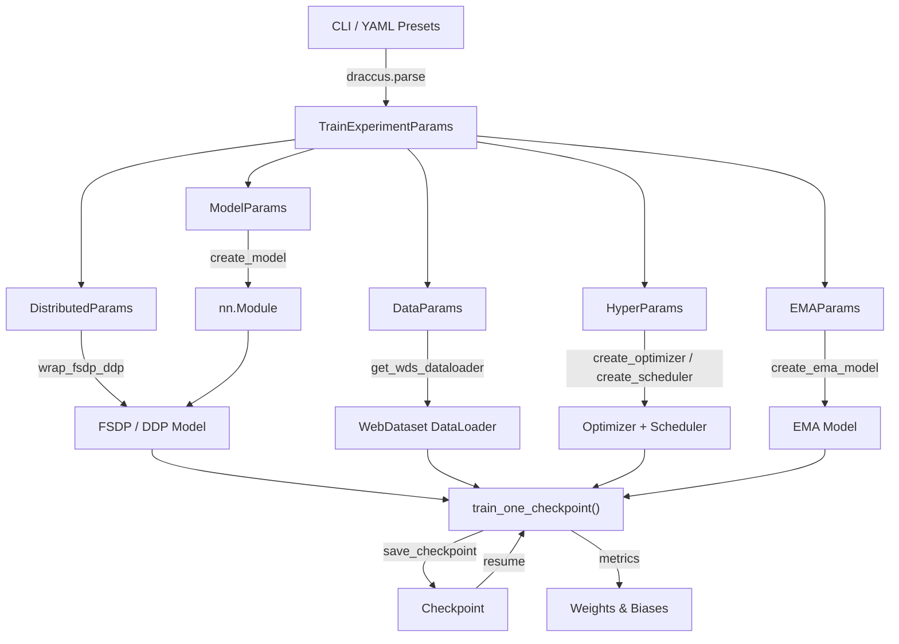
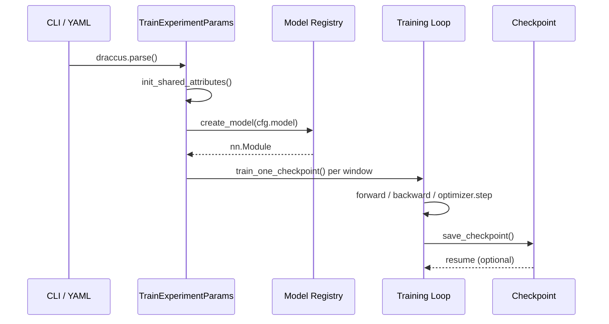

# Architecture Overview

VLA Foundry is a modular, pure-PyTorch framework for training Vision-Language-Action models. It is organized around four pillars: **configuration**, **models**, **data**, and **training**. Each pillar is self-contained, communicates through well-defined interfaces, and can be extended independently.

## System Diagram

The following diagram shows how the major subsystems connect during a training run.



## Modular Design

### Configuration (`vla_foundry/params/`)

All experiment settings live in frozen dataclasses rooted at `TrainExperimentParams`. Draccus handles parsing from YAML files and CLI arguments, and the `!include` directive lets you compose presets. See [Configuration System](configuration.md) for full details.

### Models (`vla_foundry/models/`)

Models are created through a **registry pattern**. Each model file registers a factory function and an accompanying batch handler using decorators. The training loop never imports concrete model classes directly; it asks the registry for whatever `cfg.model.type` specifies.

### Data (`vla_foundry/data/`)

Datasets are stored as WebDataset tar shards with a `manifest.jsonl` index. The data subsystem builds streaming `DataLoader` instances that can mix multiple datasets with configurable weighting. See [Data Format](data-format.md) for the on-disk layout.

### Training (`vla_foundry/train.py`, `vla_foundry/main.py`)

`main.py` is a thin orchestrator. It parses config, constructs the model and optimizer, then loops over checkpoint windows calling `train_one_checkpoint()`. Each window consumes a fixed sample budget before saving a checkpoint and optionally syncing to remote storage.

## The Model Registry

The registry lives in `vla_foundry/models/registry.py` and exposes two global dictionaries -- one for model factories, one for batch handlers.

### Registering a model

```python
from vla_foundry.models.registry import register_model, register_batch_handler

@register_model("my_model")
def create_my_model(model_params, load_pretrained=True):
    return MyModel(model_params)

@register_batch_handler("my_model")
class MyModelBatchHandler(BatchHandler):
    ...
```

When `create_model(cfg.model)` is called in `main.py`, it looks up `cfg.model.type` in the registry and invokes the matching factory function. The same `type` string is used to look up the corresponding batch handler inside `train_one_checkpoint()`.

### Why a registry?

- **Decoupled** -- new models are added by creating a file and decorating functions. No central switch statement to modify.
- **Self-contained** -- each model owns its factory, its batch handler, and its FSDP block types.
- **Discoverable** -- call `list_registered_models()` to see every available model type at runtime.

## How Components Connect

A training run flows through four phases.



### Phase 1 -- Configuration

`draccus.parse()` builds a fully resolved `TrainExperimentParams` instance. The `__post_init__` method calls `init_shared_attributes()`, which propagates derived values (such as `world_size`) from parent params down into nested children like `HyperParams` and `DataParams`.

### Phase 2 -- Construction

`create_model()` dispatches to the registered factory. The returned `nn.Module` is then wrapped for distributed training (`FSDP2` or `DDP`) and moved to the correct device and precision.

### Phase 3 -- Training

The main loop partitions `total_train_samples` into `num_checkpoints` windows. For each window it builds a `WebDataset` dataloader over the next slice of shards, then calls `train_one_checkpoint()` which runs gradient-accumulated forward/backward passes until the window's sample budget is exhausted.

### Phase 4 -- Checkpointing

After each window, model weights, optimizer state, data cursors, and shard shuffle seeds are persisted. This allows bit-exact resumption from any checkpoint, including across restarts on different hardware.

## Key Source Files

| File | Purpose |
|------|---------|
| `vla_foundry/main.py` | Top-level orchestrator |
| `vla_foundry/train.py` | `train_one_checkpoint()` inner loop |
| `vla_foundry/models/registry.py` | Model and batch-handler registries |
| `vla_foundry/models/fsdp_block.py` | `FSDPBlock` marker base class |
| `vla_foundry/params/train_experiment_params.py` | Root config dataclass |
| `vla_foundry/distributed.py` | FSDP2/DDP wrapping and distributed init |
| `vla_foundry/data/dataloader.py` | WebDataset dataloader construction |
