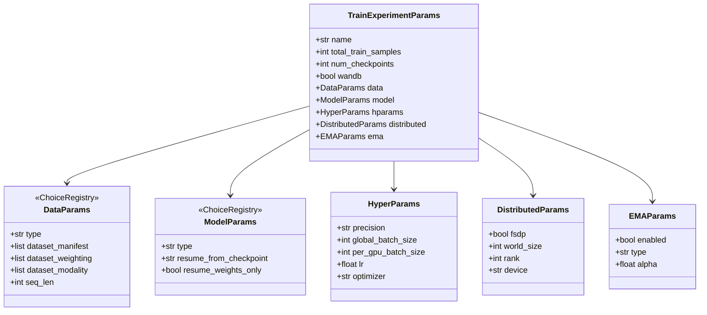

# Configuration System

VLA Foundry uses [draccus](https://github.com/dlwh/draccus) for configuration management. Every training parameter is declared as a field on a frozen Python dataclass, which means configs are type-checked, auto-documented, and can be supplied from YAML files, CLI flags, or both.

## Draccus Overview

Draccus is a lightweight library that bridges `dataclasses` and `argparse`. Given a dataclass, it generates a CLI parser whose flags mirror the field names. It also supports loading from YAML files (with an `!include` directive for composition) and merging the two sources together.

```python
# In main.py
cfg = draccus.parse(config_class=TrainExperimentParams)
```

This single call:

1. Reads any `--config_path` YAML file (if provided).
2. Overlays CLI arguments on top.
3. Instantiates a fully typed `TrainExperimentParams` object.

## Param Class Hierarchy

`TrainExperimentParams` is the root configuration object. It contains five nested parameter groups, each responsible for a different concern.



All param classes inherit from `BaseParams`, which is itself a frozen dataclass. The `frozen=True` constraint ensures that config values are not accidentally mutated after construction (internal derivation uses `object.__setattr__` to bypass the freeze when necessary).

### ChoiceRegistry classes

`ModelParams` and `DataParams` extend `draccus.ChoiceRegistry`. This means they act as abstract base classes whose concrete subclass is selected at parse time via the `type` field. For example, setting `--model.type vlm` causes draccus to instantiate `VLMParams` (a registered subclass of `ModelParams`) instead of the base class.

## Using Presets with `!include`

Large configs are best composed from reusable YAML fragments. Draccus supports an `!include` directive that inlines the contents of another YAML file at parse time.

### Preset YAML

```yaml
# config_presets/models/vlm_3b.yaml
type: vlm
vit:
  type: vit_hf
  hf_pretrained: google/siglip-so400m-patch14-384
transformer:
  type: transformer_hf
  hf_pretrained: google/gemma-2b
```

### Top-level config referencing a preset

```yaml
# my_experiment.yaml
model: !include config_presets/models/vlm_3b.yaml

data:
  type: image_caption
  dataset_manifest:
    - s3://my-bucket/dataset/manifest.jsonl

total_train_samples: 14_000_000
num_checkpoints: 10
```

You can also pass includes from the CLI:

```bash
python vla_foundry/main.py \
    --model "include config_presets/models/vlm_3b.yaml" \
    --data.type image_caption \
    --total_train_samples 14000000
```

!!! note "Include paths are relative"
    The path inside an `!include` directive is resolved relative to the YAML file that contains it. When using `"include ..."` from the CLI, paths are resolved relative to the current working directory.

## Dynamic Subclass Selection

Both `ModelParams` and `DataParams` use the draccus `ChoiceRegistry` pattern. Subclasses register themselves with a string key, and the `type` field selects which subclass to instantiate.

### How it works

```python
# In model_params.py
def register_model_params(key: str):
    def decorator(cls):
        registered_cls = ModelParams.register_subclass(key)(cls)
        registered_cls._type = key
        return registered_cls
    return decorator

@register_model_params("vlm")
@dataclass(frozen=True)
class VLMParams(ModelParams):
    vit: Union[ViTParams, ViTHFParams] = field(default_factory=ViTParams)
    transformer: Union[TransformerParams, TransformerHFParams] = field(default_factory=TransformerParams)
    ...
```

From the CLI, you select the subclass with `--model.type`:

```bash
python vla_foundry/main.py --model.type vlm --model.vit.type vit_hf ...
```

Currently registered model types include `transformer`, `transformer_hf`, `vit`, `vit_hf`, `vlm`, `vlm_hf`, `diffusion_policy`, `stable_diffusion`, `unet`, and others.

Data types follow the same pattern with `--data.type` (e.g., `text`, `text_untokenized`, `image_caption`, `robotics`).

## Shared Attributes

Some derived values need to flow from one param group into another. For example, `HyperParams` needs to know `world_size` (which lives on `DistributedParams`) to compute the gradient accumulation factor.

This is handled by the `init_shared_attributes()` mechanism:

```python
# In TrainExperimentParams.__post_init__
self.init_shared_attributes(self)
```

`BaseParams.init_shared_attributes()` recursively walks every nested `BaseParams` child and calls its `init_shared_attributes(cfg)` method, passing the root config. Each child can then pull whatever it needs:

```python
# In HyperParams
def init_shared_attributes(self, cfg):
    super().init_shared_attributes(cfg)
    object.__setattr__(self, "world_size", cfg.distributed.world_size)
```

This pattern avoids circular imports and keeps each param class self-contained about which cross-cutting values it requires.

## Precedence Order

When the same field is specified in multiple places, the following precedence applies (highest to lowest):

| Priority | Source | Example |
|----------|--------|---------|
| 1 (highest) | CLI arguments | `--hparams.lr 3e-4` |
| 2 | Preset YAML (via `--config_path` or `!include`) | `lr: 3e-4` in YAML |
| 3 (lowest) | Dataclass defaults | `lr: float = field(default=1e-4)` |

This means you can define a base config in YAML and override individual fields from the command line without editing the file.

## Resolving Configs

For debugging, you can ask VLA Foundry to print the fully resolved config and stop before training:

```bash
python vla_foundry/main.py --config_path my_experiment.yaml --resolve_configs
```

Optionally dump the resolved config to a file:

```bash
python vla_foundry/main.py --config_path my_experiment.yaml \
    --resolve_configs --resolve_configs_path /tmp/debug
```

This writes `resolved_config.yaml` with every field fully expanded, which is useful for verifying that includes and CLI overrides were applied correctly.

## Known Limitations

!!! warning "Nested include overrides"
    When a CLI argument targets a field inside an included sub-config, the entire included block may be replaced rather than merged field-by-field, depending on the draccus version. The safest approach is to use `!include` for the bulk of defaults and override only leaf-level fields from the CLI.

!!! warning "S3-hosted YAML files"
    YAML files loaded from S3 are copied to a temporary local file before parsing. Because `!include` paths are resolved relative to the file's location, `!include` directives inside S3-hosted configs will not work. Keep preset files local or on a mounted filesystem.

## Key Source Files

| File | Purpose |
|------|---------|
| `vla_foundry/params/base_params.py` | `BaseParams` base class with shared-attribute propagation |
| `vla_foundry/params/train_experiment_params.py` | `TrainExperimentParams` root config |
| `vla_foundry/params/model_params.py` | `ModelParams` and all model-type subclasses |
| `vla_foundry/params/base_data_params.py` | `DataParams` base with `ChoiceRegistry` |
| `vla_foundry/params/data_params.py` | Concrete data-type subclasses |
| `vla_foundry/params/hyper_params.py` | `HyperParams` (batch size, LR, precision) |
| `vla_foundry/params/distributed_params.py` | `DistributedParams` (FSDP, rank, device) |
| `vla_foundry/params/ema_params.py` | `EMAParams` (exponential moving average) |
