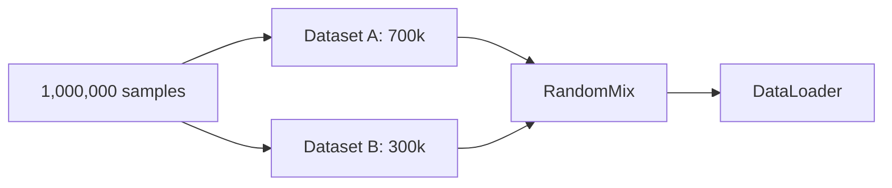

# Data Format

VLA Foundry stores training data as **WebDataset tar shards** indexed by a **manifest.jsonl** file. This format enables high-throughput streaming from local disk or S3, efficient shuffling at the shard level, and straightforward dataset mixing.

## Directory Layout

A prepared dataset follows this structure:

```
my_dataset/
  shards/
    shard-000000.tar
    shard-000001.tar
    shard-000002.tar
    ...
    shard-000099.tar
  manifest.jsonl
```

- **`shards/`** -- A directory of tar files. Each tar file contains one or more training samples.
- **`manifest.jsonl`** -- A line-delimited JSON file that indexes the shards.

!!! tip "S3 hosting (recommended)"
    Hosting datasets on S3 is the recommended approach for multi-node training. The WebDataset library streams shards directly from S3 via pipe, so no local copy is needed. The manifest itself is fetched once at the start of each checkpoint window.

## Manifest Format

`manifest.jsonl` contains one JSON object per line. Each object describes a single shard.

```json
{"shard": "shards/shard-000000.tar", "num_sequences": 512}
{"shard": "shards/shard-000001.tar", "num_sequences": 512}
{"shard": "shards/shard-000002.tar", "num_sequences": 497}
```

| Field | Type | Description |
|-------|------|-------------|
| `shard` | `string` | Relative path from the manifest to the tar file |
| `num_sequences` | `int` | Number of training samples (sequences) in this shard |

The `num_sequences` counts are used by the dataloader to calculate how many shards to select for a given sample budget, and to set the correct epoch length for the `WebLoader`.

!!! note
    The shard path in the manifest is relative to the directory containing `manifest.jsonl`. When the dataset is hosted on S3, the dataloader resolves the full URI automatically by joining the manifest's base path with the relative shard path.

## Sample Structure Within Tar Files

Each tar file is a standard POSIX tar archive. Samples within a tar are distinguished by a shared filename prefix (the sample key). Different extensions map to different fields of the sample.

```
shard-000000.tar
  sample_000000.input_ids.pth
  sample_000000.labels.pth
  sample_000000.attention_mask.pth
  sample_000001.input_ids.pth
  sample_000001.labels.pth
  sample_000001.attention_mask.pth
  ...
```

WebDataset groups files by their shared prefix and delivers each group as a Python dictionary:

```python
{
    "__key__": "sample_000000",
    "input_ids.pth": <tensor>,
    "labels.pth": <tensor>,
    "attention_mask.pth": <tensor>,
}
```

The exact set of extensions depends on the data modality:

| Modality | Typical Extensions |
|----------|--------------------|
| Text (tokenized) | `.input_ids.pth`, `.labels.pth`, `.attention_mask.pth` |
| Image-Caption | `.input_ids.pth`, `.labels.pth`, `.pixel_values.pth`, `.attention_mask.pth` |
| Robotics | `.input_ids.pth`, `.labels.pth`, `.pixel_values.pth`, `.actions.pth`, `.state.pth` |

Each data modality has a corresponding pipeline class in `vla_foundry/data/pipelines/` that knows how to decode and collate these fields.

## Multiple Datasets and Weighting

You can train on multiple datasets simultaneously by providing comma-separated manifest paths and corresponding weights.

### In YAML

```yaml
data:
  type: image_caption
  dataset_manifest:
    - s3://my-bucket/dataset_a/manifest.jsonl
    - s3://my-bucket/dataset_b/manifest.jsonl
  dataset_weighting:
    - 0.7
    - 0.3
  dataset_modality:
    - image_caption
    - image_caption
```

### From the CLI

```bash
python vla_foundry/main.py \
    --data.dataset_manifest '["s3://bucket/a/manifest.jsonl","s3://bucket/b/manifest.jsonl"]' \
    --data.dataset_weighting '[0.7, 0.3]' \
    --data.dataset_modality '["image_caption","image_caption"]'
```

!!! warning "List lengths must match"
    `dataset_manifest`, `dataset_weighting`, and `dataset_modality` must all have the same length. The training loop asserts this at startup:

    ```python
    assert len(cfg.data.dataset_manifest) == len(cfg.data.dataset_modality)
    assert len(cfg.data.dataset_manifest) == len(cfg.data.dataset_weighting)
    ```

### How weighting works

At the start of each checkpoint window, the dataloader divides the window's sample budget across datasets proportionally to their weights. For example, with a budget of 1,000,000 samples and weights `[0.7, 0.3]`, it selects shards providing roughly 700,000 samples from dataset A and 300,000 from dataset B. The selected shards are then interleaved using `wds.RandomMix`.



## Shard Selection and Shuffling

Shards are shuffled at the start of each checkpoint window using a deterministic seed. This means:

- Different checkpoint windows see shards in different orders.
- Resuming from a checkpoint replays the exact same shard order (the seed is saved alongside the checkpoint).
- When `allow_multiple_epochs` is `True`, shards are reshuffled and reused once all shards have been consumed.

The shard-level shuffle, combined with WebDataset's within-shard sample-level shuffle buffer (`shuffle_buffer_size`), provides two layers of randomization without requiring the entire dataset to fit in memory.

## DataLoader Configuration

Key `DataParams` fields that control data loading behavior:

| Field | Default | Description |
|-------|---------|-------------|
| `num_workers` | auto | DataLoader worker processes per GPU. Defaults to `cpu_count / world_size`. |
| `prefetch_factor` | `4` | Batches prefetched per worker |
| `shuffle` | `True` | Enable shard and sample shuffling |
| `shuffle_buffer_size` | `2000` | Sample-level shuffle buffer size |
| `shuffle_initial` | `500` | Initial fill of the shuffle buffer before yielding |
| `seq_len` | `2048` | Sequence length for text-based modalities |

## Key Source Files

| File | Purpose |
|------|---------|
| `vla_foundry/data/dataloader.py` | `get_wds_dataloader()` and `get_datastring_input()` |
| `vla_foundry/data/pipelines/` | Per-modality WebDataset pipeline classes |
| `vla_foundry/data/utils.py` | Manifest loading, epoch-to-sample conversion |
| `vla_foundry/file_utils.py` | `load_dataset_manifest()` with S3 and distributed support |
| `vla_foundry/params/base_data_params.py` | `DataParams` base class |
| `vla_foundry/params/data_params.py` | Concrete data-type subclasses |
