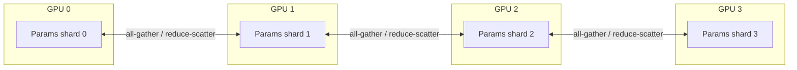

# Distributed Training

VLA Foundry uses PyTorch's **Fully Sharded Data Parallel (FSDP2)** for distributed training. FSDP2 shards model parameters, gradients, and optimizer states across GPUs, enabling training of models that exceed the memory of a single device. For simpler setups, standard DDP is also supported.

## FSDP2 Overview

FSDP2 is PyTorch's second-generation fully sharded data parallel API (`torch.distributed.fsdp.fully_shard`). Compared to the original FSDP, it offers a cleaner API and better composability with other PyTorch features.

The core idea is **parameter sharding**: each GPU holds only a slice of the model's parameters. During the forward pass, parameters are all-gathered on demand; during the backward pass, gradients are reduce-scattered. This means peak memory per GPU scales roughly as `model_size / num_gpus` instead of `model_size`.



Enable FSDP in your config:

```yaml
distributed:
  fsdp: true
```

## The FSDPBlock Pattern

FSDP wraps the model at **block boundaries** -- typically transformer layers. VLA Foundry uses two mechanisms to identify which modules should be independently wrapped.

### Custom models: `FSDPBlock` marker class

For models built from scratch, inherit your repeating block from `FSDPBlock`:

```python
from vla_foundry.models.fsdp_block import FSDPBlock

class TransformerBlock(FSDPBlock):
    def __init__(self, dim, n_heads):
        super().__init__()
        self.attn = SelfAttention(dim, n_heads)
        self.ffn = FeedForward(dim)

    def forward(self, x):
        x = x + self.attn(x)
        x = x + self.ffn(x)
        return x
```

`FSDPBlock` is a pure marker class (it inherits from `nn.Module` and adds no logic). During FSDP initialization, every module that is an instance of `FSDPBlock` is independently wrapped with `fully_shard()`.

### HuggingFace models: `get_fsdp_block_types()`

HuggingFace models use pre-existing block classes that cannot inherit from `FSDPBlock`. Instead, the model wrapper implements a `get_fsdp_block_types()` method that returns a tuple of block types to wrap:

```python
class TransformerHF(BaseModel):
    def get_fsdp_block_types(self):
        """Return HF block types for FSDP."""
        for _name, module in self.model.model.named_modules():
            if isinstance(module, nn.ModuleList) and len(module) > 0:
                return (type(module[0]),)
        raise ValueError("Could not find model block class.")
```

The FSDP wrapping logic in `distributed.py` checks for both patterns:

```python
should_wrap = isinstance(p, FSDPBlock) or (
    hf_block_types and isinstance(p, hf_block_types)
)
```

### Wrapping order

FSDP wrapping happens bottom-up:

1. Individual blocks (identified by `FSDPBlock` or `get_fsdp_block_types()`) are wrapped first.
2. The entire model is then wrapped as the outer FSDP unit.

This two-level wrapping ensures that each block is an independent sharding unit, while the top-level wrap handles any parameters outside of blocks (e.g., embeddings, final layer norms).

!!! note "Scalar parameters"
    FSDP2 does not support scalar (0-dimensional) parameters. The wrapping logic automatically detects scalar parameters (common in CLIP models) and adds them to the `ignored_params` set so they are excluded from sharding.

## Multi-GPU with torchrun

For multi-GPU training on a single node, use `torchrun`:

```bash
torchrun --nproc_per_node=8 vla_foundry/main.py \
    --config_path my_experiment.yaml \
    --distributed.fsdp true
```

`torchrun` sets the environment variables (`RANK`, `LOCAL_RANK`, `WORLD_SIZE`) that `DistributedParams` reads during initialization. The NCCL backend is used by default.

### Without FSDP

If FSDP is not enabled, the model falls back to standard `DistributedDataParallel` (DDP):

```bash
torchrun --nproc_per_node=4 vla_foundry/main.py \
    --config_path my_experiment.yaml \
    --distributed.fsdp false
```

DDP replicates the full model on each GPU and synchronizes gradients via all-reduce. This uses more memory than FSDP but has lower communication overhead for models that fit in a single GPU's memory.

## Multi-Node with SageMaker

For multi-node training, VLA Foundry can be launched on AWS SageMaker. SageMaker sets the same distributed environment variables that `torchrun` does, so `DistributedParams` initializes correctly without code changes.

A typical SageMaker launch:

```python
from sagemaker.pytorch import PyTorch

estimator = PyTorch(
    entry_point="vla_foundry/main.py",
    role=role,
    instance_count=4,
    instance_type="ml.p4d.24xlarge",
    framework_version="2.1",
    distribution={
        "torch_distributed": {"enabled": True}
    },
    hyperparameters={
        "config": "my_experiment.yaml",
        "distributed.fsdp": "true",
    },
)
estimator.fit()
```

The `init_distributed_device()` function detects the multi-node environment and initializes the process group accordingly, reading `RANK`, `LOCAL_RANK`, and `WORLD_SIZE` from the environment.

## DistributedParams

`DistributedParams` is a frozen dataclass that holds all distributed-training state. Most fields are **auto-initialized** and should not be set by the user.

```python
@dataclass(frozen=True)
class DistributedParams(BaseParams):
    # User-configurable
    dist_url: str = "env://"
    dist_backend: str = "nccl"
    fsdp: bool = False
    fsdp_cpu_offload: bool = False
    fsdp_reshard_after_forward: bool = False

    # Auto-initialized (do not set manually)
    use_distributed: bool = False
    world_size: int = 1
    rank: int = 0
    local_rank: int = 0
    device: str = None
```

During `__post_init__`, it calls `init_distributed_device()` which:

1. Checks whether `WORLD_SIZE > 1` (or SLURM equivalents).
2. If distributed, calls `torch.distributed.init_process_group()`.
3. Sets `world_size`, `rank`, `local_rank`, and `device` based on the environment.
4. Pins the current process to its local GPU via `torch.cuda.set_device()`.

### User-configurable fields

| Field | Default | Description |
|-------|---------|-------------|
| `dist_backend` | `"nccl"` | PyTorch distributed backend (`nccl` for GPU, `gloo` for CPU) |
| `fsdp` | `False` | Enable FSDP2 sharding |
| `fsdp_cpu_offload` | `False` | Offload parameters and gradients to CPU when not in use |
| `fsdp_reshard_after_forward` | `False` | Free all-gathered parameters after forward (trades compute for memory) |

## Precision Options

Precision is controlled by `hparams.precision` and affects both the FSDP mixed-precision policy and the autocast context during training.

| Value | Param dtype | Reduce dtype | Autocast | Use case |
|-------|------------|-------------|----------|----------|
| `amp_bfloat16` (default) | `bfloat16` | `float32` | Yes | Best balance of speed and stability |
| `pure_bf16` | `bfloat16` | `bfloat16` | No | Maximum throughput, may reduce stability |
| `fp32` | `float32` | `float32` | No | Full precision (debugging, baselines) |

### amp_bfloat16 (recommended)

Parameters and activations are stored in bfloat16. Gradient reductions use float32 for numerical stability. An autocast context wraps the forward pass.

```yaml
hparams:
  precision: amp_bfloat16
```

### pure_bf16

Everything runs in bfloat16, including gradient reductions. This maximizes throughput but can cause instability with large learning rates or certain model architectures.

```yaml
hparams:
  precision: pure_bf16
```

### fp32

Full float32 precision. No autocast, no mixed precision policy. Useful for debugging numerical issues.

```yaml
hparams:
  precision: fp32
```

!!! tip "Gradient accumulation and FSDP"
    During gradient accumulation, the training loop defers FSDP gradient synchronization until the final microbatch. This avoids redundant all-reduce operations and is handled automatically:

    ```python
    if isinstance(model, FSDPModule):
        is_final_accum = ii == cfg.hparams.accum_freq - 1
        model.set_requires_gradient_sync(is_final_accum)
        model.set_requires_all_reduce(is_final_accum)
        model.set_reshard_after_backward(is_final_accum)
    ```

## Key Source Files

| File | Purpose |
|------|---------|
| `vla_foundry/distributed.py` | `init_distributed_device()`, `wrap_fsdp_ddp()`, precision helpers |
| `vla_foundry/models/fsdp_block.py` | `FSDPBlock` marker base class |
| `vla_foundry/params/distributed_params.py` | `DistributedParams` dataclass |
| `vla_foundry/params/hyper_params.py` | Precision configuration (`amp_bfloat16`, `pure_bf16`, `fp32`) |
| `vla_foundry/train.py` | Gradient accumulation with FSDP sync control |
