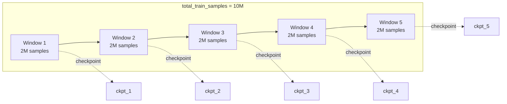
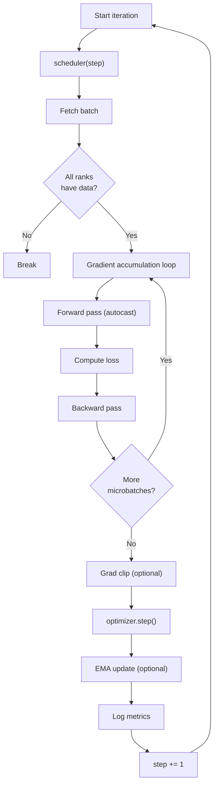

# Training Loop

VLA Foundry's training loop is split into two layers: an **outer loop** in `main.py` that manages checkpoint windows, and an **inner loop** in `train.py` that drives the actual gradient steps. The training budget is always specified in **samples**, not steps or epochs.

## High-Level Training Flow

```python
# Pseudo-code of the main training loop (main.py)

cfg = draccus.parse(TrainExperimentParams)
model = create_model(cfg.model)
model = wrap_fsdp_ddp(model, device, cfg)
optimizer = create_optimizer(cfg.hparams, model)
scheduler = create_scheduler(cfg.hparams, optimizer, cfg.total_train_samples)
loss = get_loss_function(cfg.hparams.loss_function)

for checkpoint_num in range(cfg.num_checkpoints):
    datastrings = get_datastring_input(
        num_samples=samples_per_checkpoint,
        manifest_paths=cfg.data.dataset_manifest,
        dataset_weighting=cfg.data.dataset_weighting,
        ...
    )
    dataloader = get_wds_dataloader(datastrings, ...)

    success, global_step = train_one_checkpoint(
        model, dataloader, loss, checkpoint_num,
        global_step, optimizer, scheduler, cfg
    )

    save_checkpoint(model, optimizer, ...)
```

The key insight is that the outer loop is responsible for **data selection** (which shards to load) while the inner loop is responsible for **optimization** (forward, backward, step).

## Checkpoint Windows

The total training budget is divided evenly into `num_checkpoints` windows:

```
samples_per_checkpoint = total_train_samples // num_checkpoints
```

Each window:

1. Selects enough shards from the manifest(s) to cover `samples_per_checkpoint` samples.
2. Builds a fresh `WebDataset` dataloader over those shards.
3. Calls `train_one_checkpoint()`, which runs until the window's budget is exhausted.
4. Saves a full checkpoint (model, optimizer, data cursors, shuffle seeds).
5. Optionally runs validation and syncs to remote storage.



!!! tip "Choosing `num_checkpoints`"
    More checkpoints means more frequent saves (safer against preemption) but more I/O overhead. Five checkpoints is the default. For very long runs on preemptible instances, consider increasing this value.

### Epochs vs. Samples

You can specify the training budget in two mutually exclusive ways:

| Parameter | Description |
|-----------|-------------|
| `total_train_samples` | Absolute number of samples to train on |
| `num_epochs` | Number of passes over the dataset (converted to samples internally) |

Setting both is an error. When `num_epochs` is used, `data.allow_multiple_epochs` must be `True`.

## Batch Sizing

Three parameters control how batches are constructed:

| Parameter | Location | Description |
|-----------|----------|-------------|
| `global_batch_size` | `hparams` | Total samples per optimizer step across all GPUs |
| `per_gpu_batch_size` | `hparams` | Samples per forward pass on a single GPU |
| `world_size` | `distributed` | Number of GPUs (auto-detected) |

The gradient accumulation factor is computed automatically:

```python
accum_freq = global_batch_size // (world_size * per_gpu_batch_size)
```

The configuration validates that these values are consistent at startup:

```python
assert accum_freq * world_size * per_gpu_batch_size == global_batch_size
```

### Example

| Setting | Value |
|---------|-------|
| `global_batch_size` | 512 |
| `per_gpu_batch_size` | 8 |
| `world_size` (GPUs) | 8 |
| **`accum_freq`** (computed) | **8** |

Each GPU processes 8 samples per forward pass, accumulates gradients over 8 microbatches, and then performs a synchronized optimizer step -- resulting in 8 x 8 x 8 = 512 effective samples per step.

## The Inner Loop

`train_one_checkpoint()` in `train.py` is an open-ended loop that runs until either:

- The global step count reaches `total_train_samples // global_batch_size`, or
- The dataloader is exhausted on any rank.

Each iteration performs:

1. **LR scheduling** -- `scheduler(step)` updates the learning rate.
2. **Data fetch** -- The next batch is pulled from the `WebDataset` iterator. If any rank runs out of data, all ranks break.
3. **Gradient accumulation** -- The batch is split into `accum_freq` microbatches. During FSDP training, gradient synchronization is deferred until the final microbatch.
4. **Forward/backward** -- The batch handler prepares model inputs and targets, runs the forward pass under `autocast`, computes the loss, and calls `.backward()`.
5. **Optimizer step** -- Optional gradient clipping is applied, then `optimizer.step()`.
6. **EMA update** -- If an EMA model is configured, its weights are updated.
7. **Logging** -- Loss is all-reduced across ranks and logged to wandb every `log_every_n_steps` steps.



## Resuming Training

VLA Foundry supports two modes of resumption via `ModelParams`:

### Full Resume

```yaml
model:
  type: vlm
  resume_from_checkpoint: s3://bucket/experiments/my_run/checkpoints/checkpoint_3.pt
  resume_weights_only: false   # default
```

A full resume restores:

- Model weights
- Optimizer state
- The checkpoint number and global step
- Data cursors (which shards have been consumed)
- Shard shuffle seeds

This allows training to continue exactly where it left off, including dataloader state. The outer loop detects the resumed checkpoint number and picks up from there.

### Weights-Only Resume (Fine-tuning)

```yaml
model:
  type: vlm
  resume_from_checkpoint: s3://bucket/pretrained/checkpoint.pt
  resume_weights_only: true
```

Weights-only resume loads only the model weights. Optimizer state, step counts, and data cursors start fresh. This is the mode to use when fine-tuning a pretrained model on a new dataset.

!!! note "Checkpoint path validation"
    The training script validates that the checkpoint path exists before constructing the model. If the path is invalid, a `FileNotFoundError` is raised immediately rather than failing deep in the training loop.

## Single GPU Mode

When launched without `torchrun`, VLA Foundry automatically runs in single-GPU mode:

```bash
python vla_foundry/main.py --config_path my_experiment.yaml
```

In this mode:

- `DistributedParams.world_size` is `1` and `use_distributed` is `False`.
- The model is moved directly to the GPU without FSDP or DDP wrapping.
- No process group is initialized.
- All-reduce operations in the training loop are skipped.

This is useful for debugging and small-scale experiments.

## Logging

### Weights & Biases

Logging to [Weights & Biases](https://wandb.ai) is enabled by default (`wandb: true`). On the master rank, the training loop reports:

- Training loss (averaged over the last `log_every_n_steps` steps)
- Learning rate
- Throughput (samples/sec, tokens/sec)
- Timing breakdown (data loading, forward, backward, optimizer step, sync)

Configure the wandb destination with:

```yaml
wandb: true
wandb_entity: my-team
wandb_project_name: vla_foundry
wandb_tags:
  - vlm
  - 3b
```

### Console Logging

A progress bar (via `tqdm`) shows real-time step progress, current loss, and learning rate. Full logs are also written to `experiments/<name>/out.log`.

## Key Source Files

| File | Purpose |
|------|---------|
| `vla_foundry/main.py` | Outer training loop and experiment orchestration |
| `vla_foundry/train.py` | `train_one_checkpoint()` inner training loop |
| `vla_foundry/optimizer.py` | `create_optimizer()` and `load_optimizer()` |
| `vla_foundry/scheduler.py` | `create_scheduler()` with warmup and cosine decay |
| `vla_foundry/losses.py` | `get_loss_function()` factory |
| `vla_foundry/models/ema.py` | `create_ema_model()` for exponential moving average |
| `vla_foundry/file_utils.py` | `save_checkpoint()`, `load_model_checkpoint()` |
| `vla_foundry/meters.py` | `Metrics` class for tracking timing and loss |
