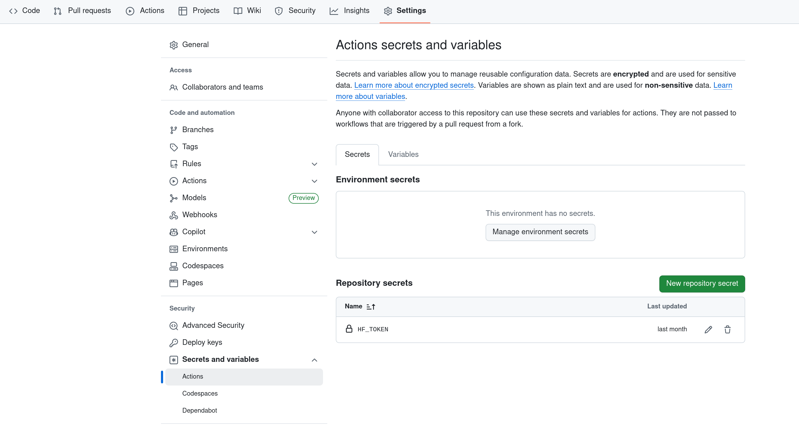

# Contributing

This guide covers how to contribute to VLA Foundry, including the development workflow, coding standards, and testing requirements.

## Guidelines

- **Test coverage** -- Code should generally have test coverage for new functionality.
- **Documentation** -- Code should be documented and follow the style guidelines described below.
- **Code review** -- All code should be reviewed by at least one feature reviewer before merging.
- **Small PRs** -- Keep pull requests as small as possible. For changes over a few hundred lines of actual code (not configs), break them into smaller PRs.
- **Branch naming** -- Branches should be attached to issues. Use the pattern `<user>/<issue_num>_<description>`. Branches can resolve more than one issue, but scoping a branch to a single issue helps keep PRs focused.
- **Avoid cross-branch work** -- As much as possible, do not work on each other's branches.
- **Merge incomplete code** -- Prefer merging incomplete code that clearly documents known limitations over maintaining long-lived branches.

## Development Process

### 1. Fork the project

Go to [vla_foundry](https://github.com/TRI-ML/vla_foundry) and click the **Fork** button to create your own copy of the repository.

!!! note
    For CI tests to pass on your fork, you may need to add your Hugging Face token. See [HF token setup for forks](#hf-token-setup-for-forks) below.

### 2. Clone your fork locally

```bash
git clone git@github.com:your-username/vla_foundry.git
```

### 3. Add the upstream repository

```bash
git remote add upstream git@github.com:TRI-ML/vla_foundry.git
git remote set-url --push upstream no_push
```

Run `git remote -v` to verify the upstream remote is listed.

### 4. Fetch the latest changes

```bash
git fetch upstream
```

### 5. (Optional) Set up pre-commit hooks

```bash
uv tool run pre-commit install
```

This runs `ruff format` and `ruff check --fix` automatically on every commit. CI enforces the same checks regardless, but the hook catches issues earlier.

### 6. Create a feature branch

```bash
git checkout -b my_feature_branch upstream/main
```

Make changes within this branch, committing as you go.

### 7. Push and create a pull request

```bash
git push origin my_feature_branch
```

Go to the VLA Foundry [repo](https://github.com/TRI-ML/vla_foundry). There should be an option to create a pull request at the top -- follow the instructions to open your PR.

### 8. Code review

We use GitHub code reviews. If changes are requested, you can amend your commit and force push:

```bash
# Make code changes
git commit --amend --no-edit
git push --force-with-lease origin
```

## Updating Requirements

VLA Foundry uses [uv](https://docs.astral.sh/uv/concepts/projects/dependencies/) for dependency management.

### Adding a requirement

```bash
uv add <dep>

# Example: adding httpx
uv add httpx

# With a version constraint (also used for updating versions):
uv add "httpx>=0.20"
```

This updates both `pyproject.toml` and `uv.lock`. Commit the updated `uv.lock` file to git.

### Removing a requirement

```bash
uv remove <dep>

# Example: removing httpx
uv remove httpx
```

This updates both `pyproject.toml` and `uv.lock`. Commit the updated `uv.lock` file.

### Generating the lock file

If the `uv.lock` file does not exist, create it by running:

```bash
uv sync
```

!!! note
    The `uv.lock` file tracks exact dependency versions for reproducible builds across machines. Always commit it after adding or removing dependencies.

## Stylistic Guidelines

VLA Foundry uses [ruff](https://github.com/astral-sh/ruff) for both formatting and linting. Ruff runs in two separate steps:

```bash
# Format code
uv run ruff format

# Lint and auto-fix
uv run ruff check --fix
```

!!! tip
    Set up your editor with a hotkey for `ruff format` to keep code consistently formatted as you work.

The project generally follows the [amended Google Python style guidelines](https://drake.mit.edu/styleguide/pyguide.html).

### Python 3.12 modernization (pyupgrade)

We enforce [pyupgrade (`UP`) rules](https://docs.astral.sh/ruff/rules/#pyupgrade-up) via ruff with `target-version = "py312"`. This enforces modern Python 3.12 idioms:

- **Modern type hints** (PEP 585/604) -- `list[int]` not `List[int]`, `X | None` not `Optional[X]`
- **`collections.abc` imports** -- `from collections.abc import Sequence` not `from typing import Sequence`
- **No `from __future__ import annotations`** -- unnecessary on 3.12
- **f-strings** -- over `%` formatting and `.format()`
- **`yield from`** -- over `for x in y: yield x`

All `UP` violations are auto-fixable with `uv run ruff check --fix`.

### Docstrings

We strongly recommend **Google-style docstrings** (`Args:`, `Returns:`, `Raises:` sections), not NumPy-style or reST-style. While not currently enforced by ruff, following this convention is encouraged for readability and consistency.

## Test Coverage

VLA Foundry uses [pytest](https://docs.pytest.org/en/stable/) for testing. Pytest features like [`@pytest.mark.parametrize`](https://docs.pytest.org/en/stable/how-to/parametrize.html) are encouraged for testing multiple configurations.

### Running tests locally

```bash
# Run all essential tests
uv run pytest tests/essential

# Run a specific test with output and name filtering
uv run pytest /path/to/my/test.py -s -k partial_string_in_test_name
```

### HF token setup for forks

When running tests from your own fork, you need to add your Hugging Face token to your fork's GitHub settings. Go to **Settings** > **Secrets and variables** > **Actions** and create a new repository secret called `HF_TOKEN`.



!!! note
    The tests use public HuggingFace models (e.g., SmolVLM2-256M). No gated model access is required, but an `HF_TOKEN` is still needed for authenticated downloads.
